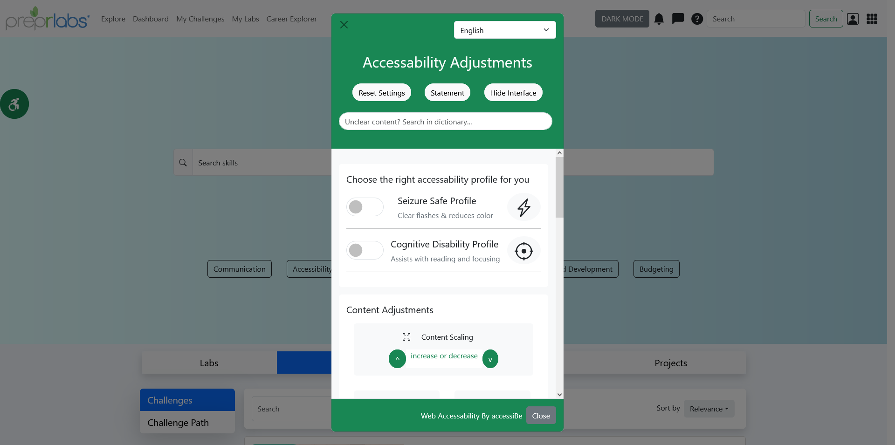
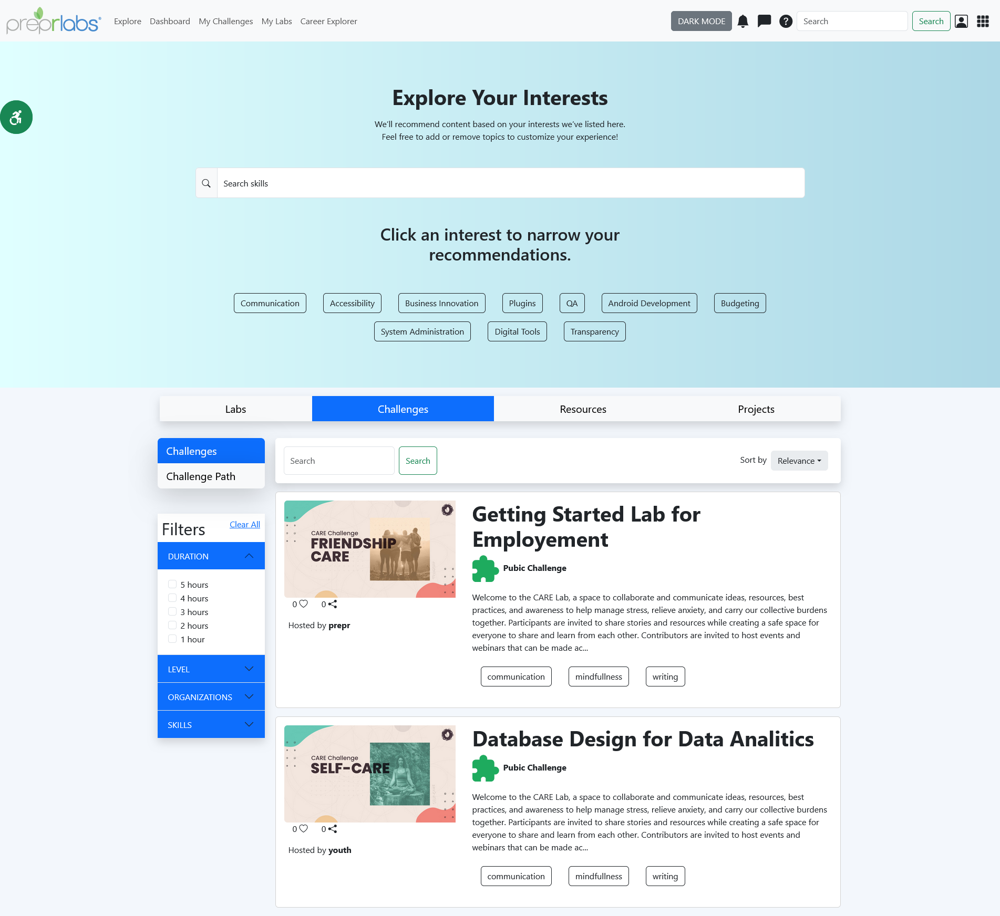
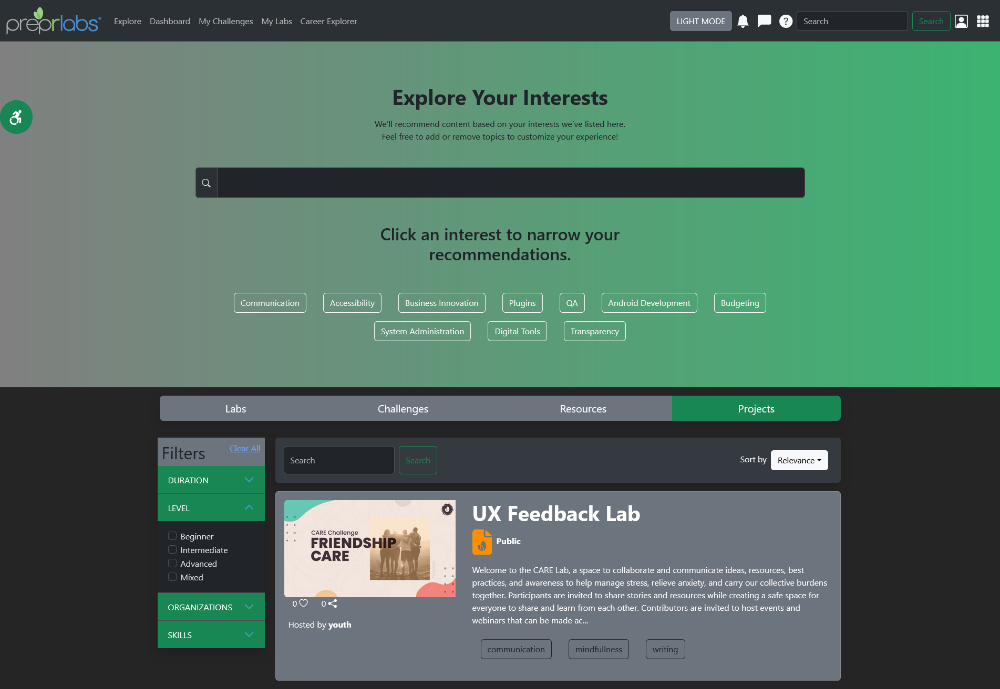

# Prepr-Frontend-Developer-Challenges 
## Challenge 1 Web Page Creation & Challenge 2 Accessability Integration 
A recreation of https://preprlabs.org/explore page (after login) made with React and Bootstrap.

Using React, Course Cards are conditionally rendered under the Labs, Challenges, and Projects menu bar (under hero section).

Course Cards are constructed manually in React and dynamically populated with course-data via props. Checkout the code in the github file under prepr-homepage/src/components/CourseCards.js

An accessability modal is implemented with page scaling (zoom in and out), language settings, toggle on/off switches, and additional adjustment buttons.

## Tech Stack and Tools
- React
- Bootstrap
- Visual Studio Code
  
## Screenshots
Accessability Modal (Challenge 4)

Light Mode (Challenge 1)

Dark Mode (Challenge 1)
